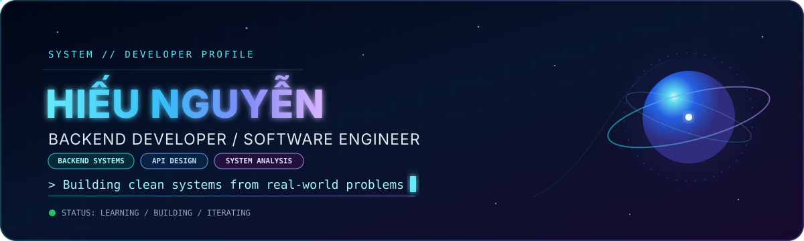
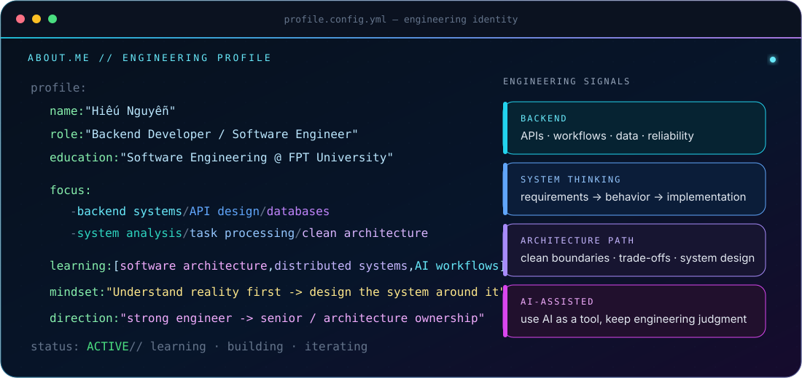
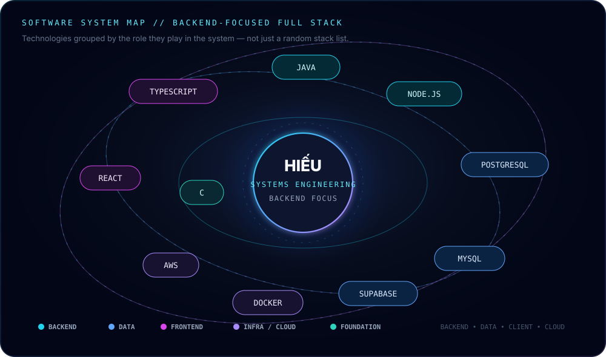
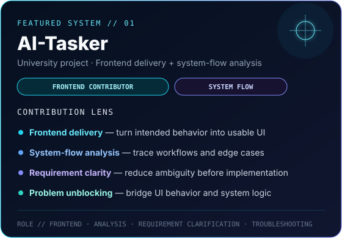
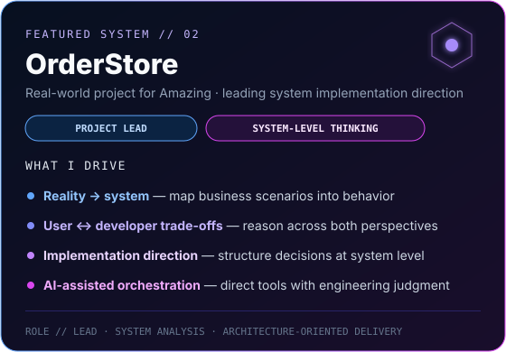

  

  
  
  
  

<strong>Think clearly. Design cleanly. Build reliably.</strong>

 

## `> SYSTEM.IDENTITY`

  

 

## `> PROFILE.CONFIG`

  

 

## `> SYSTEM.MAP`

  

 

## `> TECH.STACK & TOOLING`

  

<h4 align="center">🌐 Programming Languages</h4>

  
  
  

<h4 align="center">⚙️ Backend & Runtime</h4>

  

<h4 align="center">🎨 Frontend & Styling</h4>

  
  
  
  

<h4 align="center">🗄️ Databases & Backend Services</h4>

  
  
  

<h4 align="center">☁️ Cloud, DevOps & Systems</h4>

  
  
  
  

<h4 align="center">🧰 Tools & Design</h4>

  
  

 

## `> FEATURED.SYSTEMS`

  
  

 

## `> GITHUB.TELEMETRY`

  

  
  

 

## `> CONTRIBUTION.SNAKE`

  <picture>
    <source media="(prefers-color-scheme: dark)" srcset="https://raw.githubusercontent.com/hieund1775/hieund1775/output/github-snake-dark.svg" />
    <source media="(prefers-color-scheme: light)" srcset="https://raw.githubusercontent.com/hieund1775/hieund1775/output/github-snake.svg" />
    
  </picture>

 

## `> CONTACT.LINK`

  
  
  
  

  Open to engineering discussions, collaboration, and learning from real systems.

<strong>Think clearly. Design cleanly. Build reliably.</strong>

