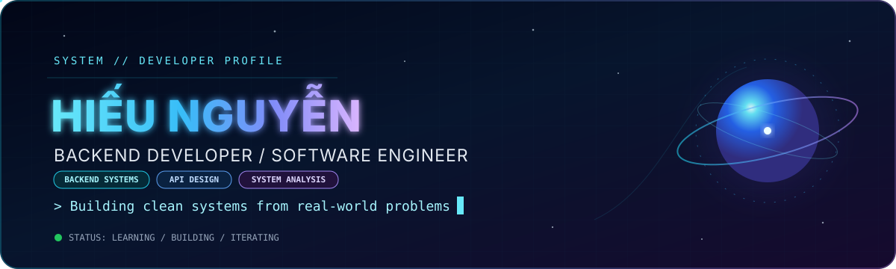
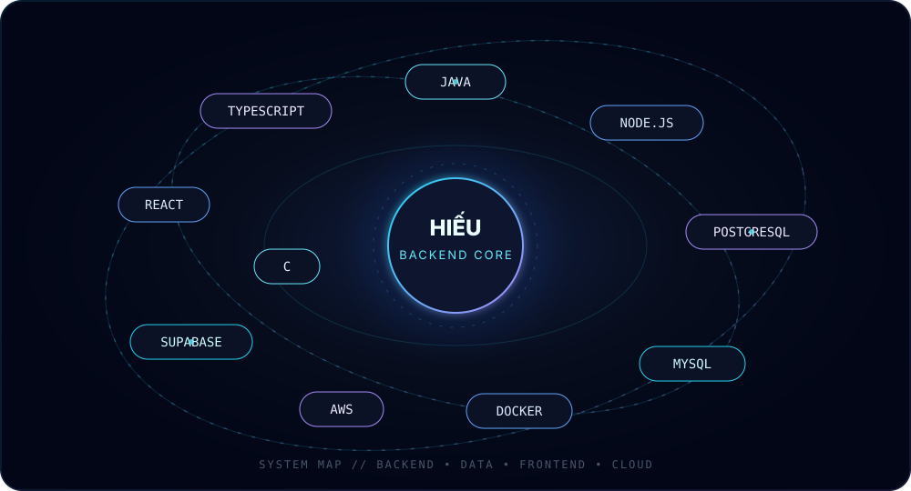
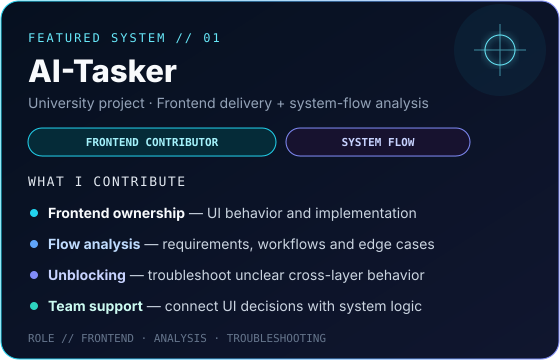
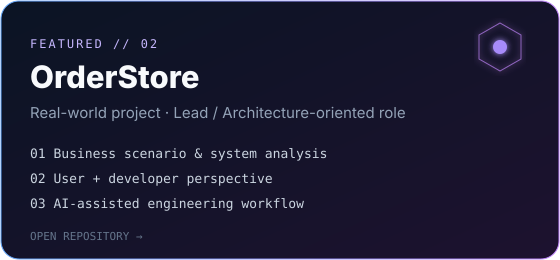

  

  
  
  
  

  <strong>Think clearly. Design cleanly. Build reliably.</strong>

 

## `> SYSTEM.IDENTITY`

  

I'm **Hiếu Nguyễn**, a **Software Engineering student at FPT University** focused on backend engineering and system-oriented problem solving.

I enjoy turning real-world requirements into clean, reliable software — from **API design, backend workflows and data modeling** to **system analysis, task processing, debugging, and architecture-oriented decisions**. I also explore **AI-assisted engineering workflows** to improve analysis, execution, and technical decision-making without losing engineering judgment.

- `FOCUS` → Backend systems, APIs, clean architecture, databases, system analysis
- `LEARNING` → Software architecture, distributed-system thinking, AI-assisted development
- `MINDSET` → Understand the problem first, then design the system around reality
- `GOAL` → Grow into a strong software engineer and eventually take senior/architecture responsibilities on impactful projects

 

## `> TECH.ORBIT`

  

  

 

## `> FEATURED.SYSTEMS`

  
  

### 🛰️ AI-Tasker
A university project where I contribute primarily to the **frontend**, while also supporting **system-flow analysis, requirement clarification, and problem solving** when implementation becomes blocked or unclear. I work across the boundary between UI behavior and overall system logic so the team can make better technical decisions.

`ROLE` Frontend Contributor · System Flow Analyst · Problem Solver

### 🚀 OrderStore
A real-world project for **Amazing** where I take a leading role in shaping implementation direction. My work includes analyzing practical business scenarios, considering both **user and developer perspectives**, structuring solutions at a system level, and using AI tools as part of an architecture-oriented engineering workflow.

`ROLE` Project Lead / Core Contributor · System Analysis · Architecture-oriented Engineering · AI-assisted Development

 

## `> GITHUB.TELEMETRY`

  

  
  

> These cards reflect public GitHub data and update automatically through the hosted summary-card API.

 

## `> CONTRIBUTION.SNAKE`

  <picture>
    <source media="(prefers-color-scheme: dark)" srcset="https://raw.githubusercontent.com/hieund1775/hieund1775/output/github-snake-dark.svg" />
    <source media="(prefers-color-scheme: light)" srcset="https://raw.githubusercontent.com/hieund1775/hieund1775/output/github-snake.svg" />
    
  </picture>

 

## `> CONTACT.LINK`

  <a href="mailto:hieund1775@gmail.com">Email</a>
  &nbsp;•&nbsp;
  <a href="https://www.linkedin.com/in/hieund-se">LinkedIn</a>
  &nbsp;•&nbsp;
  <a href="https://www.facebook.com/nguyen.hieu.196886/">Facebook</a>
  &nbsp;•&nbsp;
  <a href="https://github.com/hieund1775">GitHub</a>

  Building reliable systems, one clear decision at a time.

